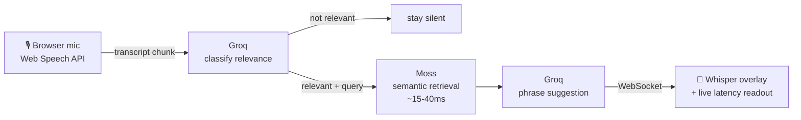

# Kairos

> A live sales-call coach that whispers the right response when it matters — powered by Moss's sub-40ms retrieval.

[](https://fastapi.tiangolo.com/)
[](https://react.dev/)
[](https://usemoss.dev/)
[](https://groq.com/)


## Table of contents

- [The problem](#the-problem)
- [How it works](#how-it-works)
- [Why Moss matters here](#why-moss-matters-here)
- [Tech stack](#tech-stack)
- [Screenshots](#screenshots)
- [Local setup](#local-setup)
- [Demo script](#demo-script)

## The problem

Objections and pricing pushback happen in real time on a call. By the time a rep remembers the right response, the moment has passed. Kairos puts relevant knowledge in view **while the conversation is still happening.**

## How it works



1. The browser captures live speech through the Web Speech API.
2. Each finalized transcript chunk goes to Groq (`openai/gpt-oss-20b`) for coaching-relevance classification.
3. Relevant chunks trigger Moss semantic retrieval — typically **15–40ms** — against a pre-indexed sales knowledge base covering objections, pricing, competitor battlecards, and deal notes. Embeddings are generated locally with `all-MiniLM-L6-v2`.
4. Groq turns the retrieved knowledge into one short, actionable coaching line.
5. The suggestion returns over WebSocket as a visible "whisper," with classification, Moss, phrasing, and total latency shown on-screen.

## Why Moss matters here

Moss reduces retrieval to a rounding error: our measured search path is approximately **15–40ms**, including the local embedding step. That leaves the user-facing latency budget for language generation instead of search. In a typical RAG setup, a vector-database round trip adds meaningful latency on top of the LLM calls; here, Moss keeps the retrieval leg fast enough to expose the actual pipeline tradeoff.

## Tech stack

| Layer | Choice | Why |
|---|---|---|
| Backend | FastAPI | Fast, async-native, clean WebSocket support |
| Frontend | React + TypeScript + Vite | Fast dev loop, typed hooks for speech/socket state |
| Retrieval | [Moss](https://usemoss.dev/) | Sub-40ms semantic search, no vector-DB round trip |
| Embeddings | `sentence-transformers` (local) | Free, no API key, no network dependency at query time |
| LLM | Groq (`openai/gpt-oss-20b`) | Free tier, extremely fast inference |
| Speech-to-text | Web Speech API | Free, browser-native, zero setup |

## Screenshots

| Landing | Live whisper | Full session |
|---|---|---|


## Local setup

<details>
<summary><strong>1. Backend setup</strong> (click to expand)</summary>

```powershell
Set-Location -LiteralPath 'D:\Real-Time Voice & Conversational AI'
& py -3 -m venv .venv
& '.\.venv\Scripts\python.exe' -m pip install -r '.\backend\requirements.txt'
Copy-Item '.\backend\.env.example' '.\backend\.env'
```

Fill in `backend/.env` with `MOSS_PROJECT_ID`, `MOSS_PROJECT_KEY`, and `GROQ_API_KEY`, then build the index:

```powershell
Set-Location -LiteralPath 'D:\Real-Time Voice & Conversational AI\backend'
& '..\.venv\Scripts\python.exe' -m scripts.build_index
```

Start the backend:

```powershell
Set-Location -LiteralPath 'D:\Real-Time Voice & Conversational AI\backend'
& '..\.venv\Scripts\python.exe' -m uvicorn app.main:app --reload --host 127.0.0.1 --port 8000
```

</details>

<details>
<summary><strong>2. Frontend setup</strong> (click to expand)</summary>

```powershell
Set-Location -LiteralPath 'D:\Real-Time Voice & Conversational AI\frontend'
& 'C:\Program Files\nodejs\node.exe' 'C:\Program Files\nodejs\node_modules\npm\bin\npm-cli.js' install
& node '.\node_modules\vite\bin\vite.js' --host 127.0.0.1
```

Open the Vite URL shown in the terminal (usually `http://127.0.0.1:5173/`). **Use Chrome or Edge** and allow microphone access when prompted.

</details>

> **Note:** commands above use direct binary paths and quoted `Set-Location` calls because this workspace path contains a space and an `&`, which breaks standard `npm run`/`python` shims on Windows.

## Demo script

Start the call, then say:

> *"Honestly, your pricing feels really high compared with the other vendors we're evaluating."*

That pricing objection should trigger a visible whisper within ~1–2 seconds, with its source category badge and full latency breakdown (Moss / Groq / total) shown on screen.
